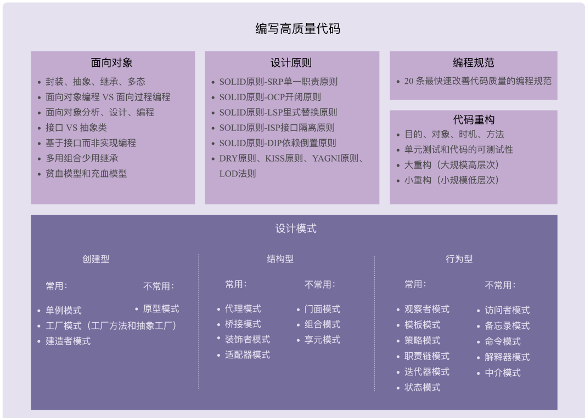

# 设计模式

> ### **思从深而行从简，真正的高手能云淡风轻地用最简单的方法解决最复杂的问题。**


## 01如何评价代码质量的高低？

### 可维护性（maintainability）

可维护性也是一个很难量化、偏向对代码整体的评价标准，它有点类似之前提到的“好”“坏”“优雅”之类的笼统评价。代码的可维护性是由很多因素协同作用的结果。代码的可读性好、简洁、可扩展性好，就会使得代码易维护；相反，就会使得代码不易维护。更细化地讲，如果代码分层清晰、模块化好、高内聚低耦合、遵从基于接口而非实现编程的设计原则等等，那就可能意味着代码易维护。除此之外，代码的易维护性还跟项目代码量的多少、业务的复杂程度、利用到的技术的复杂程度、文档是否全面、团队成员的开发水
平等诸多因素有关。  

### 可读性（readability）  

代码是否符合编码规范、命名是否达意、注释是否详尽、函数是否长短合适、模块划分是否清晰、是否符合高内聚低耦合等等。你应该也能感觉到，从正面上，我们很难给出一个覆盖所有评价指标的列表。这也是我们无法量化可读性的原因  

### 可扩展性（extensibility）  

表示我们的代码应对未来需求变化的能力。跟可读性一样，代码是否易扩展也很大程度上决定代码是否易维护。   

### 灵活性（flexibility）  

如果一段代码易扩展、易复用或者易用，我们都可以称这段代码写得比较灵活。所以，灵活这个词的含义非常宽泛，很多场景下都可以使用。  

### 简洁性（simplicity）  

那就是 KISS 原则：“Keep It Simple，Stupid”。这个原则说的意思就是，尽量保持代码简单。代码简单、逻辑清晰，也就意味
着易读、易维护。

### 可复用性（reusability）    

代码的可复用性可以简单地理解为，尽量减少重复代码的编写，复用已有的代码。  可复用性也是一个非常重要的代码评价标准，是很多设计原则、思想、模式等所要达到的最终效果 。

### 可测试性（testability）  

代码可测试性的好坏，能从侧面上非常准确地反应代码质量的好坏。代码的可测试性差，比较难写单元测试，那基本上就能说明代码设计得有问题。  


## 02 面向对象、设计原则、设计模式、编程规范、重构，这五者有何关系？  

### 面对对象

主流的编程范式或者是编程风格有三种，它们分别是面向过程、面向对象和函数式编程。面向对象这种编程风格又是这其中最主流的。   面向对象编程因为其具有丰富的特性（封装、抽象、继承、多态），可以实现很多复杂的设计思路，是很多设计原则、设计模式编码实现的基础。  

- 面向对象的四大特性：封装、抽象、继承、多态
- 面向对象编程与面向过程编程的区别和联系
- 面向对象分析、面向对象设计、面向对象编程
- 接口和抽象类的区别以及各自的应用场景
- 基于接口而非实现编程的设计思想
- 多用组合少用继承的设计思想
- 面向过程的贫血模型和面向对象的充血模型  

#### OOP(面向对象)七大原则

##### 单一职责原则

**控制类的粒度大小，将对象解耦，提高内聚性。**一个对象应该只包含单一的职责，并且该职责被完整地封装到一个类里

##### 开闭原则

**对扩展开放，对修改关闭**。即实现在不修改源代码的情况下改变这个模块的行为。

**核心：对系统进行抽象化，并从抽象化导出具体化**

##### 里氏替换原则

**继承必须确保超类所拥有的性质在子类中仍然成了成立。**任何基类可以出现的地方，子类一定可以出现。

子类必须实现父类的抽象方法，但不得重写（覆盖）父类的非抽象（已实现）方法。
子类中可以增加自己特有的方法。
当子类覆盖或实现父类的方法时，方法的前置条件（即方法的形参）、要比父类方法的输入参数更宽松。
当子类的方法实现父类的抽象方法时，方法的后置条件（即方法的返回值）要比父类更严格。

##### 依赖倒置原则

**面向接口编程，不要面向实现编程**

##### 接口隔离原则

**要为各个类建立它们需要的接口，**使用多个专门的接口来取代一个统一的接口。

##### 合成复用原则

**尽量先使用组合或者聚合等关联关系来实现，其次才考虑使用继承关系来实现。**

##### 迪米特法则

**只与你的直接朋友交谈，不跟“陌生人”说话。**即一个软件实体对其他实体的引用越少越好，或者说如果两个类就不必彼此直接通信，那么这两个类就不应当发生直接的相互作用，而是通过引入一个第三者发生间接交互。

### 设计原则  

设计原则是指导我们代码设计的一些经验总结。  几个常用的设计原则：

- SOLID 原则 -SRP 单一职责原则
- SOLID 原则 -OCP 开闭原则
- SOLID 原则 -LSP 里式替换原则
- SOLID 原则 -ISP 接口隔离原则  

- SOLID 原则 -DIP 依赖倒置原则
- DRY 原则、KISS 原则、YAGNI 原则、LOD 法则  


### 设计模式  

设计模式是针对软件开发中经常遇到的一些设计问题，总结出来的一套解决方案或者设计思路。大部分设计模式要解决的都是代码的可扩展性问题。  经典的设计模式有 23 种。随着编程语言的演进，一些设计模式（比如 Singleton）也随之过时，甚至成了反模式，一些则被内置在编程语言中（比如 Iterator），另外还有一些新的模式诞生（比如 Monostate）。  

GOF23,23种设计模式。设计模式的本质是面向对象设计原则的实际运用，是对类的封装性，继承性和多态性以及类的关联关系和组合关系的充分理解。

优点：

- 可以提高程序员的思维能力，编程能力和设计能力。
- 使程序设计更加标准化，代码编制更加工程化，使软件开发效率大大提高，从而缩短软件的开发周期。
- 使设计的代码可重用性高，可读性强，可靠性高，灵活性好，可维护性强。

==创建型模式：==

​		常用：	**单例模式，工厂模式，抽象工厂模式，建造者模式**

​		不常用： **原型模式。**

==结构型模式：==

​		常用：**适配器模式，桥接模式，装饰模式，代理模式。**

​		不常用：**组合模式，外观模式（门面模式），享元模式**

==行为型模式：==

​		常用：**模板方法模式，迭代器模式，观察者模式，状态模式，策略模式，职责模式。**

​		不常用：**备忘录模式，命令模式，中介模式，解释器模式，访问者模式。**

### 编程规范  

编程规范主要解决的是代码的可读性问题。编码规范相对于设计原则、设计模式，更加具体、更加偏重代码细节 。

### 代码重构  

持续重构是保持代码质量不下降的有效手段，能有效避免代码腐化到无可救药的地步 ，而重构的工具就是我们前面罗列的那些面向对象设计思想、设计原则、设计模式、编码规范。实际上，设计思想、设计原则、设计模式一个最重要的应用场景就是在重构的时候。    

- 重构的目的（why）、对象（what）、时机（when）、方法（how）；

- 保证重构不出错的技术手段：单元测试和代码的可测试性；
- 两种不同规模的重构：大重构（大规模高层次）和小重构（小规模低层次）。  

### 五者之间的联系  

面向对象编程因为其具有丰富的特性（封装、抽象、继承、多态），可以实现很多复杂的设计思路，是很多设计原则、设计模式等编码实现的基础。
		设计原则是指导我们代码设计的一些经验总结，对于某些场景下，是否应该应用某种设计模式，具有指导意义。比如，“开闭原则”是很多设计模式（策略、模板等）的指导原则。
		设计模式是针对软件开发中经常遇到的一些设计问题，总结出来的一套解决方案或者设计思路。应用设计模式的主要目的是提高代码的可扩展性。从抽象程度上来讲，设计原则比设计模式更抽象。设计模式更加具体、更加可执行。
		编程规范主要解决的是代码的可读性问题。编码规范相对于设计原则、设计模式，更加具体、更加偏重代码细节、更加能落地。持续的小重构依赖的理论基础主要就是编程规范。
		重构作为保持代码质量不下降的有效手段，利用的就是面向对象、设计原则、设计模式、编码规范这些理论。  




***

## 面对对象

**面向对象编程语言是支持类或对象的语法机制，并有现成的语法机制，能方便地实现面向对象编程四大特性（封装、抽象、继承、多态）的编程语言。**  

一般来讲， 面向对象编程都是通过使用面向对象编程语言来进行的，但是，不用面向对象编程语言，我们照样可以进行面向对象编程。  反过来讲，即便我们使用面向对象编程语言，  写出来的代码也不一定是面向对象编程风格的，也有可能是面向过程编程风格的。  

**按照严格的定义，很多语言都不能算得上面向对象编程语言，但按照不严格的定义来讲，现在流行的大部分编程语言都是面向对象编程语言。**  

is a代表的是类之间的继承关系，比如PC机是计算机，工作站也是计算机。PC机和工作站是两种不同类型的计算机，但都继承了计算机的共同特性。因此在用Java语言实现时，应该将PC机和工作站定义成两种类，均继承计算机类。

has a代表的是对象和它的成员的从属关系。同一种类的对象，通过它们的属性的不同值来区别。比如一台PC机的操作系统是Windows，另一台PC机的操作系统是Linux。操作系统是PC机的一个成员变量，根据这一成员变量的不同值，可以区分不同的PC机对象。

**is a的意思是如果A是B，那么B就是A的基类。**

**has a 是如果A中有B，那么，B就是A的组成部分**

### 面向对象分析  

面向对象分析（OOA），全称是 Object Oriented Analysis  


### 面向对象设计 

面向对象设计（OOD） ，全称是 Object Oriented Design。  


### 面向对象编程

面向对象编程（OOP）  全称是 Object Oriented Programming。  	

**面向对象编程是一种编程范式或编程风格。它以类或对象作为组织代码的基本单元，并将封装、继承、多态三个特性，作为代码设计和实现的基石 。**


OOA、OOD、OOP 三个连在一起就是面向对象分析、设计、编程（实现），正好是面向对象软件开发要经历的三个阶段。  围绕着对象或类来做需求分析和设计的。分析和设计两个阶段最终的产出是类的设计，包括程序被拆解为哪些类，每个类有哪些属性方法，类与类之间如何交互等等。它们比其他的分析和设计更加具体、更加落地、更加贴近编码，更能够顺利地过渡到面向对象编程环节。这也是面向对象分析和设计，与其他分析和设计最大的不同点。  

### 统一建模语言（UML）

UML（UnifiedModel Language），统一建模语言。 常用它来画图表达面向对象或设计模式的设计思路。   包含我们常提到类图，还有用例图、顺序图、活动图、状态图、组件图等  

***

### 面向对象的特性

#### 封装（**Encapsulation**）

> 封装也叫做信息隐藏或者数据访问保护。类通过暴露有限的访问接口，授权外部仅能通过类的类提供的  方式（或者叫函数）来访问内部信息或数据。

对于封装这个特性，我们需要编程语言本身提供一定的语法机制来支持。这个语法机制就是**访问权限控制。**如果没有提供访问权限控制语法，则没有办法达到隐藏信息和保护数据的目的了，也就无法支持封装特性。

#### 抽象（Abstraction）

> 抽象讲的是如何隐藏方法的具体实现，让调用者只需要关心方法提供了哪些功能，并不需要知道这些功能是如何实现的。

在面向对象编程中，我们常借助编程语言提供的接口类（比如 Java 中的 interface 关键字语法）或者抽象类（比如 Java 中的 abstract 关键字语法）这两种语法机制，来实现抽象这一特性。

实际上，抽象的实现，并不需要非得依靠接口类或者抽象类这些特殊语法机制来支持。换句话说，并不是说一定要为实现类抽象出接口类，才叫作抽象。即便不编写接口类，单纯的实现类本身就满足抽象特性。

抽象这个概念是一个非常通用的设计思想，并不单单用在面向对象编程中，也可以用来指导架构设计等。而且这个特性也并不需要编程语言提供特殊的语法机制来支持，只需要提供“函数”这一非常基础的语法机制，就可以实现抽象特性、所以，它没有很强的“特异性”，有时候并不被看作面向对象编程的特性之一。

#### 继承（Inheritance）

> 继承是用来表示类之间的is-a 关系，比如猫是一种哺乳动物。从继承关系上来讲，继承可以分为两种模式，单继承和多继承。单继承表示一个子类只继承一个父类，多继承表示一个子类可以继承多个父类，

为了实现继承这个特性，编程语言需要提供特殊的语法机制来支持，比如 Java 使用extends 关键字来实现继承，C++ 使用冒号（class B : public A），Python 使用paraentheses()，Ruby 使用 <。不过，有些编程语言只支持单继承，不支持多重继承，比如 Java、PHP、C#、Ruby 等，而有些编程语言既支持单重继承，也支持多重继承，比如C++、Python、Perl 等。

**继承最大的一个好处就是代码复用。**

#### 多态（Polymorphism）

>多态是指，子类可以替换父类，在实际的代码运行过程中，调用子类的方法实现。

```java
public class DynamicArray { 
    private static final int DEFAULT_CAPACITY = 10; 
    protected int size = 0; 
    protected int capacity = DEFAULT_CAPACITY; 
    protected Integer[] elements = new Integer[DEFAULT_CAPACITY]; 
    
    public int size() { return this.size; } 
    public Integer get(int index) { return elements[index];} 
    //... 省略 n 多方法... 
    public void add(Integer e) { 
        ensureCapacity(); 
        elements[size++] = e; 
    } 
    
    protected void ensureCapacity() { 
        //... 如果数组满了就扩容... 代码省略... 
    } 
} 

public class SortedDynamicArray extends DynamicArray { 
    @Override 
    public void add(Integer e) { 
        ensureCapacity(); 
        for (int i = size-1; i>=0; --i) { // 保证数组中的数据有序
            if (elements[i] > e) { 
                elements[i+1] = elements[i]; 
            } else { 
                break; 3
            } 
        } 
        elements[i+1] = e; 
        ++size; 
    } 
} 
public class Example { 
    public static void test(DynamicArray dynamicArray) { 
        dynamicArray.add(5); 
        dynamicArray.add(1); 
        dynamicArray.add(3); 
        for (int i = 0; i < dynamicArray.size(); ++i) {
            System.out.println(dynamicArray[i]); 
        } 
    } 
    public static void main(String args[]) { 
        DynamicArray dynamicArray = new SortedDynamicArray(); 
        test(dynamicArray); // 打印结果：1、3、5 
    }     
}
```

**多态这种特性也需要编程语言提供特殊的语法机制来实现。**在上面的例子中，我们用到了三个语法机制来实现多态。

- 第一个语法机制是编程语言要支持父类对象可以引用子类对象，也就是可以将SortedDynamicArray 传递给 DynamicArray。
- 第二个语法机制是编程语言要支持继承，也就是 SortedDynamicArray 继承了DynamicArray，才能将 SortedDyamicArray 传递给 DynamicArray。
- 第三个语法机制是编程语言要支持子类可以重写（override）父类中的方法，也就是SortedDyamicArray 重写了 DynamicArray 中的 add() 方法。

通过这三种语法机制配合在一起，我们就实现了在 test() 方法中，子类SortedDyamicArray 替换父类 DynamicArray，执行子类 SortedDyamicArray 的 add()方法，也就是实现了多态特性。

对于多态特性的实现方式，除了利用“继承加方法重写”这种实现方式之外，我们还有其他两种比较常见的的实现方式，一个是利用接口类语法，另一个是利用 duck-typing 语法。不过，并不是每种编程语言都支持接口类或者 duck-typing 这两种语法机制，比如 C++就不支持接口类语法，而 duck-typing 只有一些动态语言才支持，比如 Python、JavaScript 等。

##### 利用接口类来实现多态特性

```java
public interface Iterator { 
    String hasNext(); 
    String next(); 
    String remove();
} 
public class Array implements Iterator { 
    private String[] data; 
    public String hasNext() { ... } 
    public String next() { ... } 
    public String remove() { ... } 
    //... 省略其他方法... 
} 
public class LinkedList implements Iterator { 
    private LinkedListNode head; 
    public String hasNext() { ... } 
    public String next() { ... } 
    public String remove() { ... } 
    //... 省略其他方法... 
} 
public class Demo { 
    private static void print(Iterator iterator) { 
        while (iterator.hasNext()) { 
            System.out.println(iterator.next()); 
        } 
    } 
    public static void main(String[] args) {
        Iterator arrayIterator = new Array(); 
        print(arrayIterator); 
        Iterator linkedListIterator = new LinkedList(); 
        print(linkedListIterator); 
    } 
}
```

Iterator 是一个接口类，定义了一个可以遍历集合数据的迭代器。Array 和LinkedList 都实现了接口类 Iterator。我们通过传递不同类型的实现类（Array、LinkedList）到 print(Iterator iterator) 函数中，支持动态的调用不同的 next()、hasNext() 实现。

**像 Java 这样的静态语言，通过继承实现多态特性，必须要求两个类之间有继承关系，通过接口实现多态特性，类必须实现对应的接口。**

***

### 面向对象编程和面向过程编程的区别

#### 面向过程

面向过程编程也是一种编程范式或编程风格。它以过程（可以为理解方法、函数、操作）作为组织代码的基本单元，以数据（可以理解为成员变量、属性）与方法相分离为最主要的特点。面向过程风格是一种流程化的编程风格，通过拼接一组顺序执行的方法来操作数据完成一项功能。

面向过程编程语言首先是一种编程语言。它最大的特点是不支持类和对象两个语法概念，不支持丰富的面向对象编程特性（比如继承、多态、封装），仅支持面向过程编程

#### 面向对象编程相比起面向过程编程的优势主要有三个。

- 对于大规模复杂程序的开发，程序的处理流程并非单一的一条主线，而是错综复杂的网状结构。面向对象编程比起面向过程编程，更能应对这种复杂类型的程序开发。

- 面向对象编程相比面向过程编程，具有更加丰富的特性（封装、抽象、继承、多态）。利用这些特性编写出来的代码，更加易扩展、易复用、易维护。

- 从编程语言跟机器打交道的方式的演进规律中，我们可以总结出：面向对象编程语言比起面向过程编程语言，更加人性化、更加高级、更加智能。

### 抽象类和接口

####  抽象类和接口的语法特性

抽象类不允许被实例化，只能被继承。它可以包含属性和方法。方法既可以包含代码实现，也可以不包含代码实现。不包含代码实现的方法叫作抽象方法。子类继承抽象类，必须实现抽象类中的所有抽象方法。接口不能包含属性，只能声明方法，方法不能包含代码实现。类实现接口的时候，必须实现接口中声明的所有方法。

#### 抽象类和接口存在的意义

抽象类是对成员变量和方法的抽象，是一种 is-a 关系，是为了解决代码复用问题。接口仅仅是对方法的抽象，是一种 has-a 关系，表示具有某一组行为特性，是为了解决解耦问题，隔离接口和具体的实现，提高代码的扩展性。

#### 抽象类和接口的应用场景区别

如果要表示一种is-a 的关系，并且是为了解决代码复用问题，我们就用抽象类；如果要表示一种 has-a 关系，并且是为了解决抽象而非代码复用问题，那我们就用接口。

### 接口

> **“基于接口而非实现编程”这条原则的英文描述是：“Program to an interface, not an implementation”。**

从本质上来看，“接口”就是一组“协议”或者“约定”，是功能提供者提供给使用者的一个“功能列表”。“基于接口而非实现编程”这条原则中的“接口”，可以理解为编程语言中的接口或者抽象类。

应用这条原则，可以将接口和实现相分离，封装不稳定的实现，暴露稳定的接口。上游系统面向接口而非实现编程，不依赖不稳定的实现细节，这样当实现发生变化的时候，上游系统的代码基本上不需要做改动，以此来降低耦合性，提高扩展性。

“基于接口而非实现编程”这条原则的另一个表述方式，是“基于抽象而非实现编程”。

**越抽象、越顶层、越脱离具体某一实现的设计，越能提高代码的灵活性，越能应对未来的需求变化。好的代码设计，不仅能应对当下的需求，而且在将来需求发生变化的时候，仍然能够在不破坏原有代码设计的情况下灵活应对。而抽象就是提高代码扩展性、灵活性、可维护性最有效的手段之一。**

### 继承

####  为什么不推荐使用继承？

继承是面向对象的特性之一，用来表示类之间的 is-a 关系，可以解决代码复用的问题。虽然继承有诸多作用，但继承层次过深、过复杂，也会影响到代码的可维护性。在这种情况下，我们应该尽量少用，甚至不用继承。

####  组合相比继承有哪些优势？

继承主要有三个作用：表示 is-a 关系，支持多态特性，代码复用。而这三个作用都可以通过组合、接口、委托三个技术手段来达成。除此之外，利用组合还能解决层次过深、过复杂的继承关系影响代码可维护性的问题。

#### 如何判断该用组合还是继承？

尽管我们鼓励多用组合少用继承，但组合也并不是完美的，继承也并非一无是处。在实际的项目开发中，我们还是要根据具体的情况，来选择该用继承还是组合。如果类之间的继承结构稳定，层次比较浅，关系不复杂，我们就可以大胆地使用继承。反之，我们就尽量使用组合来替代继承。除此之外，还有一些设计模式、特殊的应用场景，会固定使用继承或者组合。


## 创建型模式

### 工厂模式

分类：简单工厂模式（静态工厂模式），工厂方法模式，抽象方法模式。 

这种设计模式也是 Java 开发中最常见的一种模式，它的主要意图是定义一个创建对象的接口，让其子类自己决定实例化哪一个工厂类，工厂模式使其创建过程延迟到子类进行。

简单说就是为了提供代码结构的扩展性，屏蔽每一个功能类中的具体实现逻辑。让外部可以更加简单的只是知道调用即可，同时，这也是去掉众多`ifelse`的方式。当然这可能也有一些缺点，比如需要实现的类非常多，如何去维护，怎样减低开发成本。但这些问题都可以在后续的设计模式结合使用中，逐步降低。